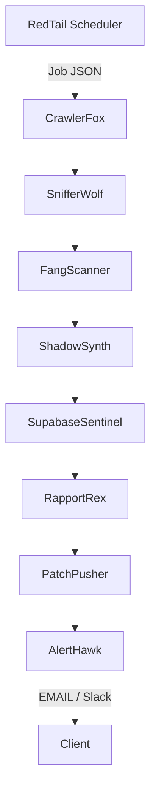

# RedFox Securities — rfx-audit-v2 Agents Manifest

_AKA agents.md – the war-map for every line of code that prowls in the Audit stack._

**Version:** 0.4-alpha  
**Date:** 2025-07-01  
**Maintainer:** Mihaly "Misi" Szabo <root@redfoxsec>  
**Mood:** caffeinated, slightly malicious, fully legal.

## TL;DR
rfx-audit-v2 is a pack of containerised agents that claw through a target's public surface, gnaw the findings into structured intel, and spit out branded PDFs and JSON you can bill for. Orchestration lives in n8n, state in Supabase, AI in ShadowSynth. Everything runs inside Docker and communicates over WireGuard.

**Lifecycle:** `Crawler → Scanner → Analyst → Reporter → Patcher → Notifier`

## System Context
Drawn from every ChatGPT conversation tagged `rfx-audit` between 2025-06-24 and 2025-07-01 (see Appendix).

### Goals
- Automated exposure assessment for SMB websites.
- Upsell path: instant fixes, remote support, or "hire-a-hacker" retainer.

### Non-goals
- Full-blown pentests or infrastructure scans beyond HTTP(S).
- Anything illegal—we're punks, not prisoners.

## Agent Directory

| Agent Code-Name      | Image / Runtime        | Trigger          | Core Duties                                                                    | Output                |
|----------------------|------------------------|------------------|--------------------------------------------------------------------------------|-----------------------|
| **RedTail Scheduler**| `cron:alpine`          | Cron / REST      | Wake the pack, enqueue targets, rate-limit by plan tier                         | Job JSON → Supabase queue |
| **CrawlerFox**       | `node:lts-alpine`      | Queue event      | Discover sub-domains & sub-dirs (wayback, DNS scrape, robots, sitemap)         | `discovery.json`      |
| **SnifferWolf**      | `python:3.12-slim`     | After Crawler    | Passive recon: headers, tech stack, third-party fingerprints                    | `passive.json`        |
| **FangScanner**      | `gobuster` / `nuclei`  | After SnifferWolf | Active vuln sweep (OWASP Top 10 + custom templates)                             | `scan_results.json`   |
| **ShadowSynth**      | `ollama:alice` + OpenAI| Async            | LLM ranks findings, dedupes false positives, adds CVSS and fix tips            | `analysis.json`       |
| **RapportRex**       | `node:pdf-buddy`       | On analysis      | Build HTML & PDF report, blend RedFox branding, push to Supabase storage       | `report.pdf`          |
| **PatchPusher**      | `python:flask`         | On analysis      | Generate one-click remediation scripts / Nginx rules / hardening steps         | `patch_bundle.zip`    |
| **AlertHawk**        | `node:mailer`          | After report     | Send email + webhook (Slack/Discord) with report link & upsell CTA             | –                     |
| **Supabase Sentinel**| `supabase/postgres`    | Always           | Persist everything; row-level security with JWT                                | DB rows               |
| **BlackBox Logger**  | `grafana/loki`         | Side-car         | Central log aggregation + Prometheus metrics                                   | Logs                  |

_Naming is half the fun—feel free to rename agents, just keep the attitude._

## Agent Details

1. **RedTail Scheduler (Job Dispatcher)**
   - Keeps the audit train on time.
   - Trigger modes: CRON, manual REST `POST /launch`, or n8n UI button.
   - Environment: `TZ`, `REDTAIL_PLAN_MAX_CONCURRENCY`, `SUPABASE_SERVICE_KEY`.

2. **CrawlerFox (Surface Mapper)**
   - Recursively digs the target, resolves DNS, enumerates via Certificate Transparency, pulls `sitemap.xml`, scrapes for `href` links.
   - Emits a weighted list so we don't nuke a client's dev subdomain on the Tier-1 plan.

3. **SnifferWolf (Passive Recon)**
   - Tech fingerprint via Wappalyzer CLI.
   - Captures security headers, TLS grade, HTTP/2 and QUIC support.

4. **FangScanner (Active Vuln Scan)**
   - Tools: Nuclei, Subzy, custom FoxScripts.
   - Parallelised by Go routines (cap at 32 threads or plan cap).

5. **ShadowSynth (AI Analyst)**
   - Hybrid: local Alice model (DeepSeek Coder 6.7B fine-tuned) for cheap stuff; falls back to OpenAI GPT-4o for heavy synthesis.
   - Adds CVSS, business impact rating, and a snarky executive summary (because C-suite loves drama).

6. **RapportRex (Report Builder)**
   - Uses Puppeteer to print HTML → PDF.
   - Injects RedFox dark-mode CSS, your NordVPN disclaimer and a unique watermarked QR.

7. **PatchPusher (Remediation Kit)**
   - Creates a ZIP of shell scripts, `.htaccess`, CSP headers or Terraform diffs.
   - Returns a JSON schema so the front-end can render inline "Fix with one click" buttons.

8. **AlertHawk (Notifier)**
   - NodeMailer + Slack webhook.
   - Respects client escalation matrix (`contact_roles` table).

9. **Supabase Sentinel (Data-Layer)**
   - Tables: `queue`, `targets`, `findings`, `reports`, `usage`, `clients`, `roles`, `audit_logs`.
   - Row-level security: agent service role key bypasses; client JWT limited to own org.

10. **BlackBox Logger (Observability)**
    - Loki for logs, Prometheus Node Exporter metrics, Grafana dashboards.
    - Alerts Slack if a container OOMs or a scan runs over 90 minutes.

## Communication Topology



All traffic travels inside the `rfx_net` Docker network or a WireGuard mesh if multi-host.

## Deployment (Docker Compose excerpt)

```yaml
version: "3.9"
services:
  scheduler:
    image: ghcr.io/redfoxog/redtail-scheduler:latest
    environment:
      - SUPABASE_URL=${SUPABASE_URL}
      - SUPABASE_SERVICE_KEY=${SUPABASE_SERVICE_KEY}
  crawler:
    image: ghcr.io/redfoxog/crawlerfox:latest
    depends_on: [scheduler]
  sniffer:
    image: ghcr.io/redfoxog/snifferwolf:latest
    depends_on: [crawler]
  scanner:
    image: ghcr.io/redfoxog/fangscanner:latest
    volumes:
      - ./templates:/app/templates
  analyst:
    image: ghcr.io/redfoxog/shadowsynth:latest
    environment:
      - OPENAI_API_KEY=${OPENAI_API_KEY}
  reporter:
    image: ghcr.io/redfoxog/rapportrex:latest
  patcher:
    image: ghcr.io/redfoxog/patchpusher:latest
  notifier:
    image: ghcr.io/redfoxog/alerthawk:latest
  supabase:
    image: supabase/postgres
    volumes:
      - db:/var/lib/postgresql/data
volumes:
  db:
```

Production lives in Portainer stacks; devs can `docker compose up`.

## Environment Variables Cheat-Sheet

```bash
# Global
SUPABASE_URL=https://db.redfoxsec.com
SUPABASE_SERVICE_KEY=...
OPENAI_API_KEY=...
REDFOX_BRAND_THEME=dark

# Scheduler
REDTAIL_PLAN_MAX_CONCURRENCY=5

# Scanner
NUCLEI_SEVERITY=medium,high,critical
```

See `.env.example` in the repo.

## Supabase Schema Snapshot

```sql
create table targets (
  id uuid primary key default gen_random_uuid(),
  url text not null,
  client_id uuid references clients(id),
  created_at timestamp default now()
);
-- scans, findings, reports, usage ...
```

Full DDL lives in `database/schema.sql`.

## Security & Isolation Notes
- Each agent runs as a non-root UID and uses a read-only filesystem where possible.
- Inter-agent auth via short-lived JWT signed with `REDFOX_SECRET_SALT`.
- No container can reach the raw Docker socket (learned that the hard way—see 2025-06-30 chat).
- Rate limits enforced by RedTail; emergency brake in Supabase function `fn_block_abuse()`.

## Observability Playbook
- Grafana dashboard: `rfx-audit/overview.json`.
- Prom alerts → `#ops-war-room` Slack.
- Loki retention 14 days, then S3 cold storage.

## Future Roadmap (v2 → v3)
- Add WASM-based real-time progress UI.
- Integrate Burp Enterprise API for deep scans.
- Multi-tenant self-serve portal with Stripe metered billing.
- RAG-powered knowledge base agent ("FoxGuru").

## Appendix — Chat Artefacts Referenced
- 0630T20:35 Expand Website Auditor – sub-domain crawler discussion.
- 0630T11:27 Docker Setup for RFX Audit – containerisation hurdles.
- 0628T19 RedFox Audit Web App – MVP scope, Supabase wiring.
- 0629T12 MHN Web Auditor Integration – front-end linkage.
- 0629T08 Email Labeling Loop Fix – n8n optimisation patterns (borrowed for Scheduler).
- 0627T14 CIOReview Scam Alert – (funny, but not relevant).
- Plus assorted dream logs reminding us to ship.
